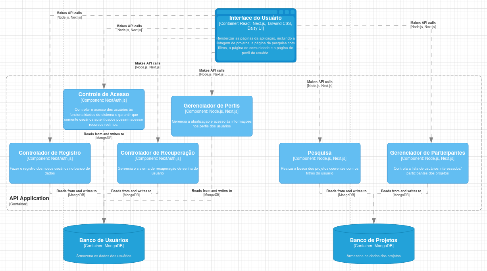

# MC656 - Projeto

## Tema
Geração de oportunidades acadêmicas para estudantes brasileiros.

**Figma**: https://www.figma.com/design/BCHSqNuaqeNWbRLbZMmuoN/Prot%C3%B3tipo-de-Alta-Fidelidade?node-id=0-1&node-type=canvas&t=3vdT0A9Lcj3cREzN-0

## Arquitetura do Projeto

**Estilo arquitetural escolhido**: Model-View-Controller (MVC)

<!-- Descrição do Estilo: -->
O estilo arquitetural Model-View-Controller (MVC) foi escolhido para este projeto devido à sua capacidade de separar claramente as responsabilidades em um sistema. Ele divide a aplicação em três componentes principais:

> **Model**: Representa os dados e a lógica de negócio, incluindo o acesso ao banco de dados e regras de manipulação dos dados.
>
> **View**: Responsável pela apresentação dos dados ao usuário, seja em formato de página web ou interface gráfica.
>
> **Controller**: Atua como intermediário entre a View e o Model, processando as entradas dos usuários, manipulando os dados e atualizando a View de forma adequada.

O MVC foi escolhido por permitir uma clara separação de responsabilidades, o que facilita a manutenção e evolução do sistema. Ele também suporta o desenvolvimento modular, onde a camada de apresentação pode ser alterada sem impactar diretamente a lógica de negócios.

**Padrão de projeto escolhido**: Observer (Publish/Subscribe)

<!-- Descrição do Padrão: -->
Para o componente de comunidade, onde o usuário pode ver as atividades dos amigos, o padrão de projeto Observer (Publish/Subscribe) foi escolhido. Esse padrão permite que objetos sejam assinantes de eventos gerados por outros objetos. No contexto da plataforma desenvolvida pelo nosso grupo, quando um usuário se inscreve em um projeto, os amigos do usuário podem ficar sabendo de tal informação através da página de "comunidade" da plataforma.

<!-- Como funciona e justificativa: -->

> **Funcionamento**: O padrão Observer permite que o sistema de comunidade atue como um "publicador" de eventos de inscrição, enquanto os perfis dos amigos são os "assinantes". Sempre que um usuário se inscreve em um projeto e deseja compartilhar sua experiência, o sistema publica um evento que é enviado aos perfis dos amigos para atualização.
>
> **Justificativa**: Esse padrão é adequado pois promove um sistema desacoplado, onde os módulos de notificação de atividades e de perfis de usuários podem funcionar de forma independente, melhorando a escalabilidade e a manutenibilidade.

## Principais componentes do projeto

1. **Página Inicial:** Exibe todos os projetos do banco de dados e permite a navegação para as páginas de detalhes.

2. **Página do Projeto:** Mostra informações detalhadas sobre o projeto selecionado, como descrição, categoria e participantes.

3. **Página de Pesquisa:** Contém filtros para refinar a busca por projetos com base em categorias e interesses.

4. **Página de Comunidade:** Exibe projetos em que os amigos do usuário estão inscritos.

5. **Página de Perfil:** Permite que o usuário visualize e edite suas informações pessoais e gerencie seus projetos inscritos.

## Diagrama de Componentes (C4 - Nível 3)

Abaixo seguem as descrições dos principais componentes e suas responsabilidades:

### Interface do Usuário
**Responsabilidade:** Renderizar as páginas da aplicação, incluindo a listagem de projetos, a página de pesquisa com filtros, a página de comunidade e a página de perfil do usuário.  
**Tecnologias:** React, Next.js, Tailwind CSS, Daisy UI

### Componente de Controle de Acesso
**Responsabilidade:** Controlar o acesso dos usuários às funcionalidades do sistema e garantir que somente usuários autenticados possam acessar recursos restritos.  
**Tecnologias:** NextAuth.js

### Componente de Controle de Registro
**Responsabilidade:** Fazer o registro dos novos usuários no banco de dados.  
**Tecnologias:** NextAuth.js

### Componente de Controle de Recuperação
**Responsabilidade:** Gerenciar o sistema de recuperação de senha do usuário.  
**Tecnologias:** NextAuth.js

### Componente de Gerenciador de Perfis
**Responsabilidade:** Gerenciar a atualização e acesso às informações nos perfis dos usuários.  
**Tecnologias:** Node.js, Next.js

### Componente de Pesquisa
**Responsabilidade:** Realizar a busca dos projetos coerentes com os filtros do usuário.  
**Tecnologias:** Node.js, Next.js

### Componente de Gerenciador de Participantes
**Responsabilidade:** Controlar a lista de usuários interessados/participantes dos projetos.  
**Tecnologias:** Node.js, Next.js

### Componente de Banco de Usuários
**Responsabilidade:** Armazenar os dados dos usuários, tais como informações de perfil e de acesso.  
**Tecnologias:** MongoDB

### Componente de Banco de Projetos
**Responsabilidade:** Armazenar os dados dos projetos, detalhes, imagens, lista de participantes e outras informações relevantes.  
**Tecnologias:** MongoDB
